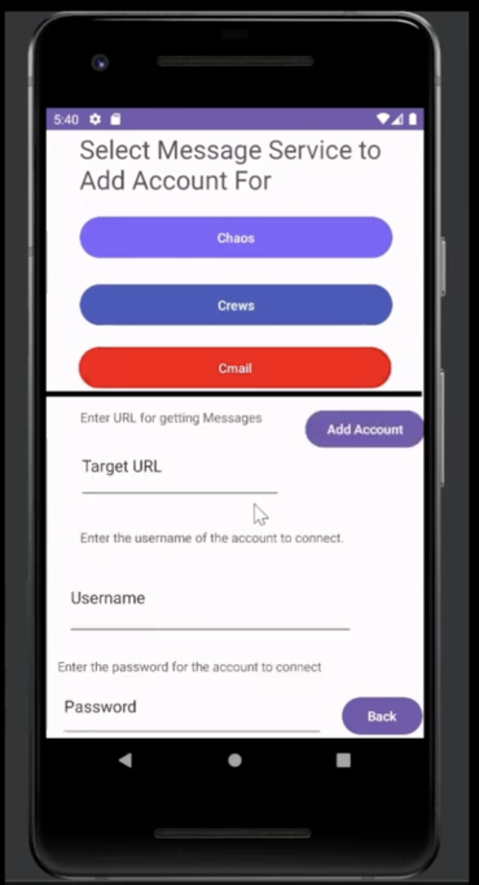
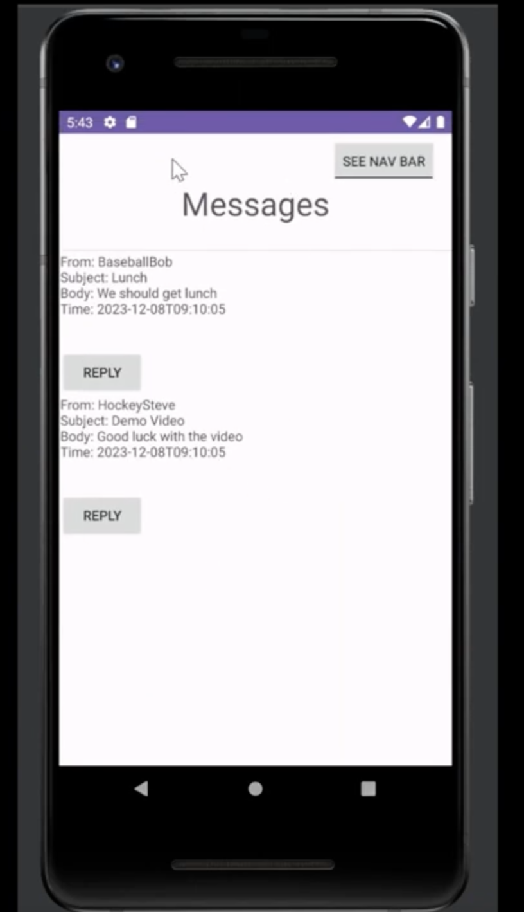
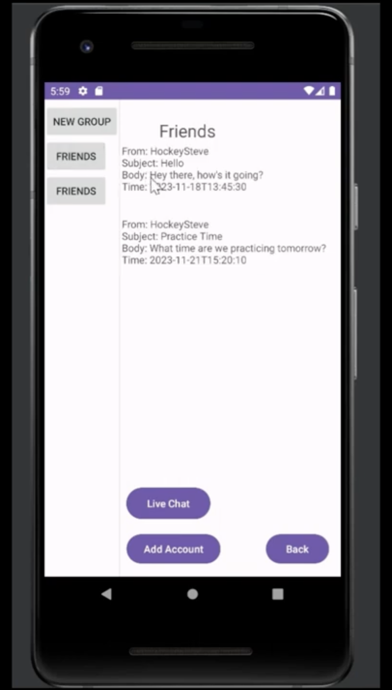
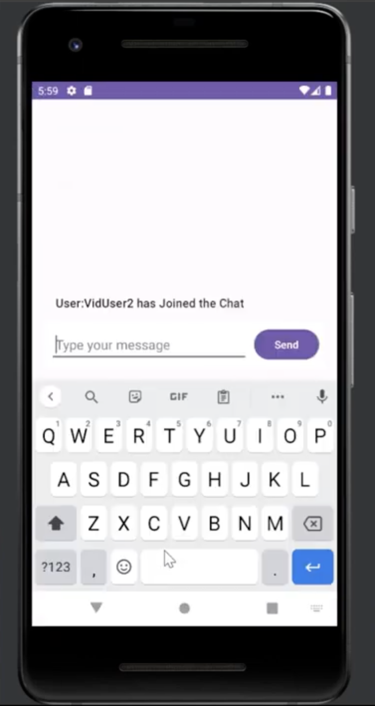

# CheckMe

CheckMe is a proof of concept Android app to simplify the proccess of keeping track of message from a variety of different sources. It allows a user to pass along API/account credentials for their regularly used mesaging services (Email addresses, Messaging apps (Like Teams or Slack), etc) and CheckMe will retrieve the messages that those accounts receive and dispaly them all together within the CheckMe app.

As CheckMe is a proof of concept and hasn't been permanetly deployed it currently receives its message data from the Proxy webapp due to being unable to participate in the oauth flow.

## Features

### Adding Accounts

Once the user has setup and signed into a CheckMe account they will be able to add a new outside account to their CheckMe. CheckMe will then retrieve messages from any Rest API provided with the outside service connected to that account.

In order to add an account the user will need to provide a link to the API endpoint that the CheckMe app will need to access as well as credentials for that endpoint. The app will ask for different kinds of credentials depending on what messaging service was selected

### Message Listing

On the main account screen all the messages from any added accounts will be shown together in chronological order. Here the user can interact with the messages to view only one and send replies. Replies are sent by CheckMe using the API exposed by the corresponding message service. 

As its set up the Proxy API which stands in for actual outside messaging services adds replies to its database when CheckMe sends them.

| Image of the screen in the app where a user can add an outside account               | Image of the message listing seen on a user account | 
| :----------------------------------------------------------------------------------: | :--------------------------------------------------------------------------------: |
|  |  |

### Groups

CheckMe users can also join groups. Groups allow messages from an account from amessage service to be distributed to multiple CheckMe users. Groups also have livechats which utilize web sockets to allow users to send messages to each other.

| Image of the screen which lists the groups a user is in.                             | Image of group live chat  | 
| :----------------------------------------------------------------------------------: | :--------------------------------------------------------------------------------: |
|  |  |

## Technology used

### Frontend 

The frontend for CheckMe is an android app created written in Java using android studio.

### Backend

The backend for CheckMe is a web server created with Java and Springboot. The Proxy stand in API is also built with Spingboot.

### Database 

CheckMe utilizes an SQL database managed using the Java Persistence API.

## My Role

My role on the project was originally to work on developing the Springboot backend but midway through I began to work more on the frontend. While working on the backend I made an effort 

## Notes 
*This repository has been mirrored/forked and was originally hosted on a private gitlab server* 

## Authors and acknowledgment
This project was created by me and a group as part of Com S 309 at Iowa State University.
Contributors:
- Luke Broglio (Me)
- Joshua Arceo
- Joel Brickley

